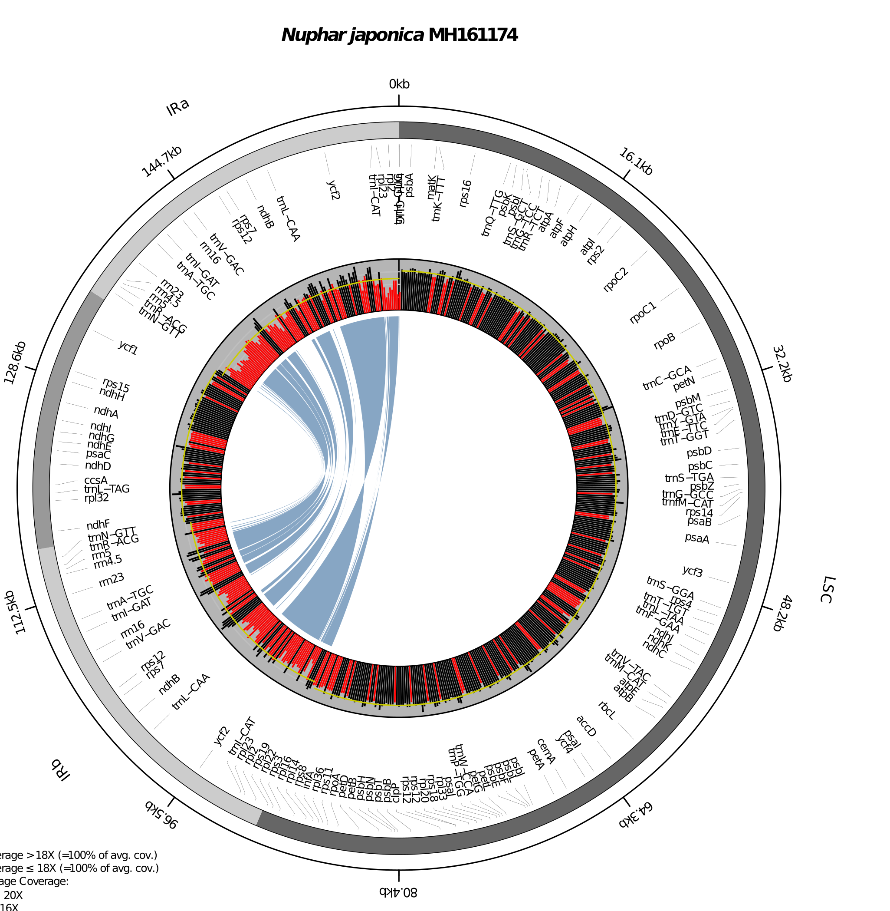

*PACVr*
=======

Plastome Assembly Coverage Visualization in R

## INSTALLATION
```
library(devtools)
install_github("michaelgruenstaeudl/PACVr")
```
Note: Detailed installation instructions can be found in the package vignette.

## USAGE
```
# In R:
library(PACVr)
gbkFile <- system.file("extdata", "MH161174/MH161174.gb", package="PACVr")
bamFile <- system.file("extdata", "MH161174/MH161174_PlastomeReadsOnly.sorted.bam", 
                       package="PACVr")
outFile <- paste(tempdir(), "/MH161174_AssemblyCoverage_viz.pdf", sep="")
PACVr.complete(gbk.file=gbkFile, bam.file=bamFile, windowSize=250, 
               mosdepthCmd='mosdepth', logScale=FALSE, threshold=0.5,
               syntenyLineType=3, relative=TRUE, textSize=0.5,
               delete=TRUE, output=outFile)
```

## OUTPUT


<!--
## CITATION
Using PACVr in your research? Please cite it!

- Gruenstaeudl M., Jenke N. (2019). foo bar baz

```
@article {Gruenstaeudl435644,
    author = {Gruenstaeudl, Michael and Hartmaring, Yannick},
    title = {EMBL2checklists: A Python package to facilitate the user-friendly submission of plant DNA barcoding sequences to ENA},
    elocation-id = {435644},
    year = {2018},
    doi = {10.1101/435644},
    URL = {https://www.biorxiv.org/content/early/2018/10/05/435644},
    journal = {bioRxiv}
}
```
-->


<!--
## TO DO
* ~~Let us try to expand the genome size range of the input genome that can be handled by PACVr (currently between 100kb to 200kb). Maybe we can push it to a range of 50kb to 250kb? I know that the limitation is caused by RCircos, which does not generate a readable plot at a certain large or small size, but maybe you can tweak some parameters to maximize the allowed size range. In fact, maybe you can implement a dynamic adjustment of the plot based on the length of the input genome? That would be awesome! --> Upon modification of the code, please test the modified version of PACVr for such unusually-sized plastid genomes. To that end, please try to find a complete plastid genome sequence as well as its raw reads (look in the short read archive!) for a very small plastid genome (NCBI search string: “complete genome[TITLE] AND (chloroplast[TITLE] OR plastid[TITLE]) AND 50000:100000[SLEN]”) as well as for a very large plastid genome (NCBI search string: “complete genome[TITLE] AND (chloroplast[TITLE] OR plastid[TITLE]) AND 200000:250000[SLEN]”).~~

* ~~Let us please adjust the code so that it checks if two IRs are present in the input genome (i.e., IRa and IRb). If yes, PACVr shall conduct a normal visualization. If not (i.e., only a single IR present), PACVr shall turn off the gene synteny visualization, but continue with the coverage depth visualization.~~

* ~~Adjust the code such that it checks if the two IRs of the input genome (assuming that two IRs are found for the input genome) are of equal length and equal sequence. If there are differences in either length or sequence of the IRs, print a warning to the screen that describes these differences. Then, code execution shall continue.~~

* ~~Please adjust the code such that the threshold value below which a histogram bar is displayed in red can be provided by the user either as an absolute value (e.g., 15X; optional parameter “threshold_absolute”) or a relative value (e.g., 15% of global average; optional parameter “threshold_relative”). The relative value shall be calculated against the average coverage depth across all four regions.~~

* ~~One of the reviewer requests the following: "It would be better if the PACVr output figure can have an extra layer of tick marks of genome coordinates in every 20kb, similar to figure 1C. It helps to visualize the relative position of the quadripartite regions." Let us please adjust the code to achieve this.~~
-->


## CHANGELOG
See [`CHANGELOG.md`](CHANGELOG.md) for a list of recent changes to the software.

