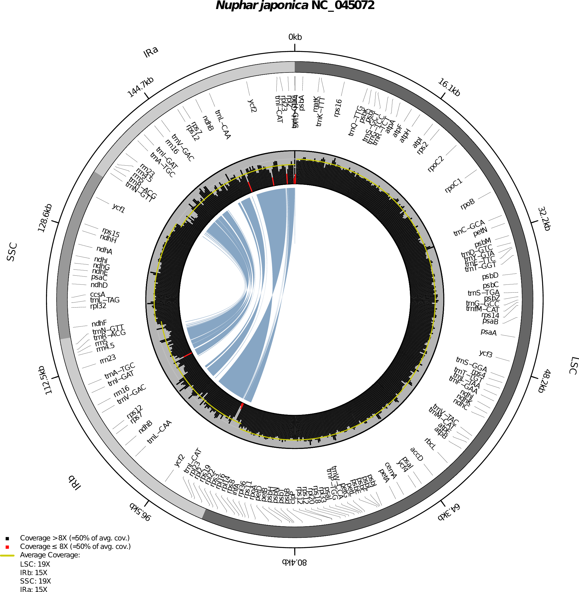

*PACVr*
=======

Plastome Assembly Coverage Visualization in R

## INSTALLATION
```
library(devtools)
install_github("michaelgruenstaeudl/PACVr")
```
Note: Detailed installation instructions can be found in the package vignette.

## PRE-FORMATTING INPUT
Due to the internal usage of R package [genbankr](https://bioconductor.org/packages/release/bioc/html/genbankr.html), any GenBank flatfile must conform to the following specifications: 
- Flatfile must include a _source_ feature at start of feature table
- All _exon_ features (plus their qualifier lines) must be removed: `sed -i -e '/    exon/,+2d' input.gb`
- All redundant _complement_ specifications must be removed: `sed -i -z 's/),\s*complement(/,/g' input.gb`
<!--
- All duplicate lines, if any, must be removed: `sed -i '$!N; /^\(.*\)\n\1$/!P; D' input.gb`
-->

## USAGE
```
# In R:
library(PACVr)
gbkFile <- system.file("extdata", "NC_045072/NC_045072.gb", package="PACVr")
bamFile <- system.file("extdata", "NC_045072/NC_045072_PlastomeReadsOnly.sorted.bam", 
                       package="PACVr")
outFile <- paste(tempdir(), "/NC_045072_AssemblyCoverage_viz.pdf", sep="")
#outFile <- "../Desktop/test.pdf"  # on R-Studio for Windows
PACVr.complete(gbkFile, bamFile, windowSize=250, 
               logScale=FALSE, threshold=0.5, syntenyLineType=3, 
               relative=TRUE, textSize=0.5,  regionsCheck=FALSE,
               verbose=FALSE, output=outFile)
```

## OUTPUT


## FULLY AUTOMATED
```
SMPLNME="Cb01A_IOGA"
INFASTA=${SMPLNME}.fasta
READSR1=Cb01A_PlastomeReadsOnly_R1.fastq
READSR2=Cb01A_PlastomeReadsOnly_R2.fastq

mkdir -p db
bowtie2-build $INFASTA db/${SMPLNME}
bowtie2 -x db/${SMPLNME} -1 $READSR1 -2 $READSR2 -S ${SMPLNME}_mapping.sam
samtools view -Sb -F 0x04 ${SMPLNME}_mapping.sam > ${SMPLNME}_mapping_OneMoreLocations.bam
samtools sort ${SMPLNME}_mapping_OneMoreLocations.bam > ${SMPLNME}_mapping_OneMoreLocations.sorted.bam
rm $(ls *.?am | grep -v sorted)
samtools index ${SMPLNME}_mapping_OneMoreLocations.sorted.bam
Rscript PACVr/inst/extdata/PACVr_Rscript.R -k ${SMPLNME}.gb -b ${SMPLNME}_mapping_OneMoreLocations.sorted.bam -t 0.5 -r TRUE -d FALSE -o ${SMPLNME}_CoverageDepth.pdf
```

## CITATION
Using PACVr in your research? Please cite it!

```
@article {GruenstaeudlAndJenke2020,
    author = {Gruenstaeudl, M. and Jenke, N.},
    title = {PACVr: plastome assembly coverage visualization in R},
    year = {2020},
    doi = {10.1186/s12859-020-3475-0},
    journal = {BMC Bioinformatics},
    volume = {21},
    pages = {207}
}
```

<!--
## TO DO
* Foo bar baz
* Foo bar baz
-->


## CHANGELOG
See [`CHANGELOG.md`](CHANGELOG.md) for a list of recent changes to the software.

